# 3-SAT — Experimental Analysis

This project is about the satisfiability of 3-SAT formulas through experimental simulations using different solving strategies. Inspired by computational complexity theory and the analogy with phase transitions in physics, I compare the behavior of:

    Naive Backtracking
    Backtracking with Unit Propagation Heuristic
    MiniSAT, a state-of-the-art industrial SAT solver

---

## Table of Contents

- [3-SAT Solver — Phase Transition Analysis](#3-sat-solver--phase-transition-analysis)
- [Environment Setup](#environment-setup)
- [Usage](#usage)

---

## 3-SAT Solver — Phase Transition Analysis

The **3-SAT problem** is one of the most studied NP-complete problems: given a logical formula in conjunctive normal form (CNF) made of clauses with exactly 3 literals each, does there exist a boolean assignment of the variables that satisfies all clauses simultaneously?

This experiment explores the phenomena of **phase transition** of 3-SAT as a function of the M/N ratio (number of clauses / number of variables). From literature: the critical threshold **M/N ≈ 4.27**, where a sharp change occurs; below it, almost all random instances are satisfiable (SAT), above it, almost none are (UNSAT). Instances near the threshold are computationally the hardest, and solver runtimes reach their peak there.

The code compares three solving approaches:

| Solver | Description |
|--------|-------------|
| `backtracking` | Classic recursive backtracking, exhaustively explores the search tree |
| `heuristics` | Backtracking with **unit propagation**: if a clause has only one literal left, its assignment is forced, that helps to prune the search space |
| `minisat` | External solver based on **CDCL** (Conflict-Driven Clause Learning), orders of magnitude faster on hard instances |

### Collected Data

For each combination of solver, value of N, and M/N ratio the code measures:
- percentage of satisfiable instances out of 100 experiments
- average solving time

### Generated Plots

- **`plt_prob_*`** — Percentage of SAT instances as a function of M/N; shows the sigmoid of phase transition
- **`plt_times_*`** — Average execution times as a function of M/N; highlights the hardness peak at the critical threshold
- **`plt_sat_*`** — Point-by-point distribution of SAT (blue) / UNSAT (orange) instances in the time–ratio plane for a fixed N

<details>

<summary><strong> Backtracking </strong></summary>

<br>

|  |  |
|---------|----------|
| %SAT ~ M/N | 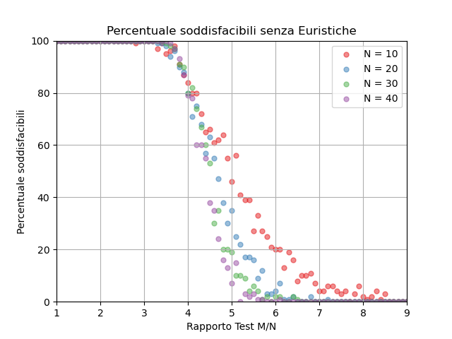 |
| Execution Time| 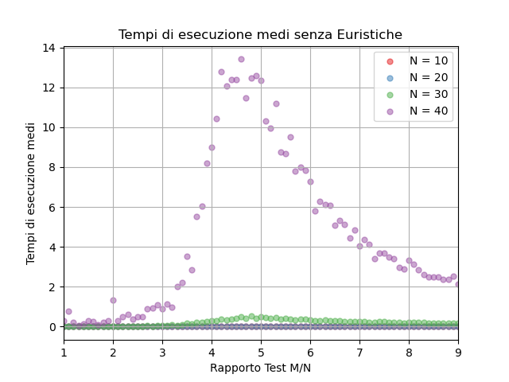 |
| SAT-UNSAT | 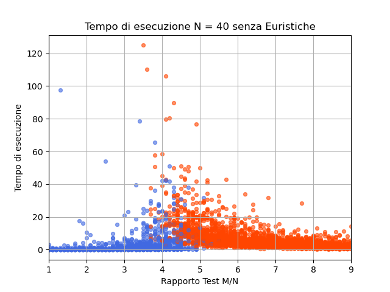 |
</details>

<details>

<summary><strong> Backtracking with Heuristic </strong></summary>

<br>

|  |  |
|---------|----------|
| %SAT ~ M/N | 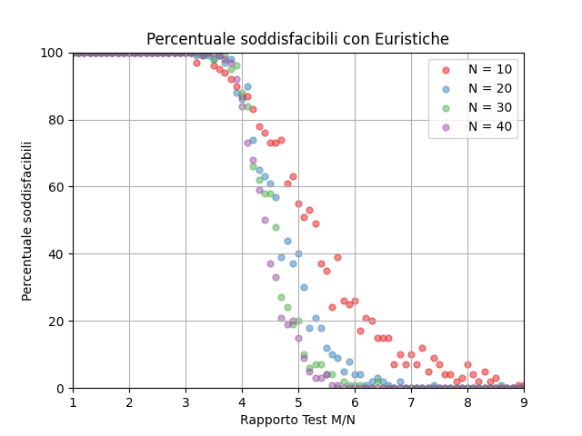 |
| Execution Time| 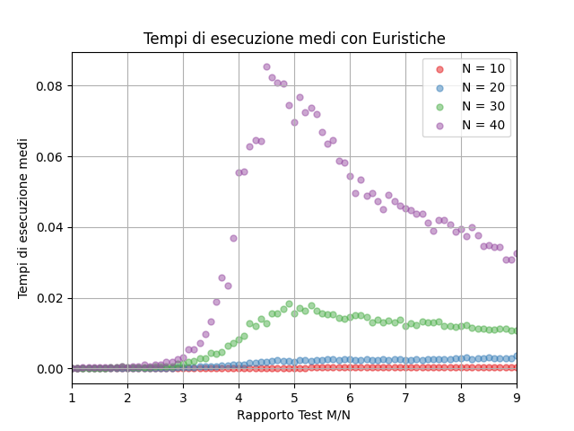 |
| SAT-UNSAT | 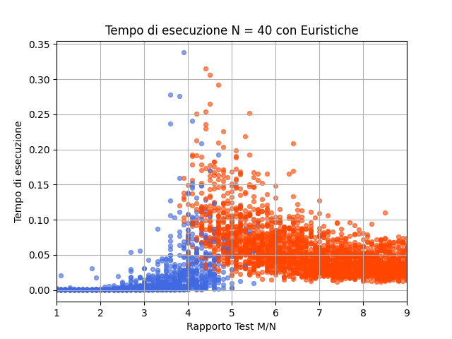 |
</details>

<details>

<summary><strong> Minisat </strong></summary>

<br>

|  |  |
|---------|----------|
| %SAT ~ M/N | 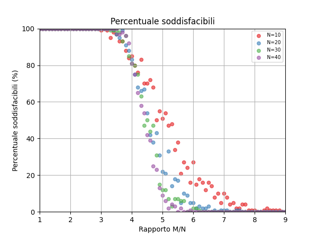 |
| Execution Time| 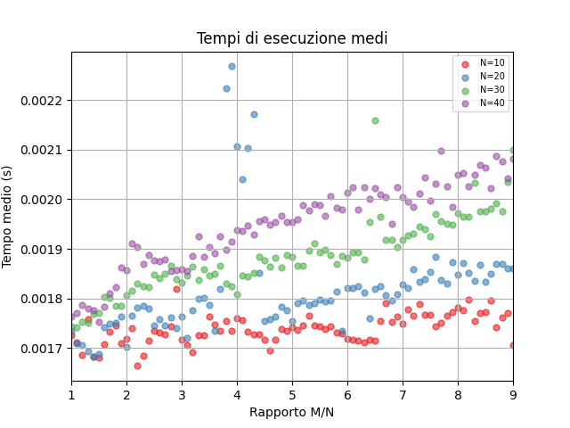 |
| SAT-UNSAT | 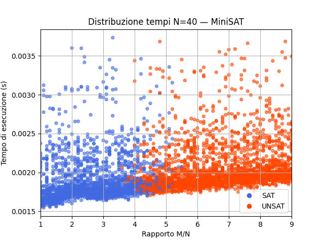 |
</details>

<details>

<summary><strong> Minisat (Increased M&N)</strong></summary>

<br>

|  |  |
|---------|----------|
| %SAT ~ M/N | 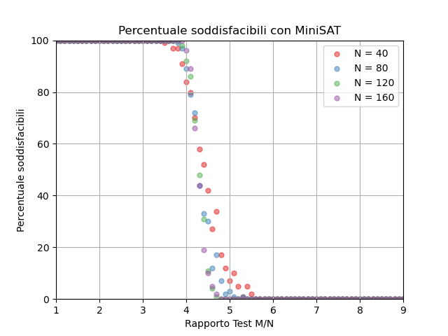 |
| Execution Time| 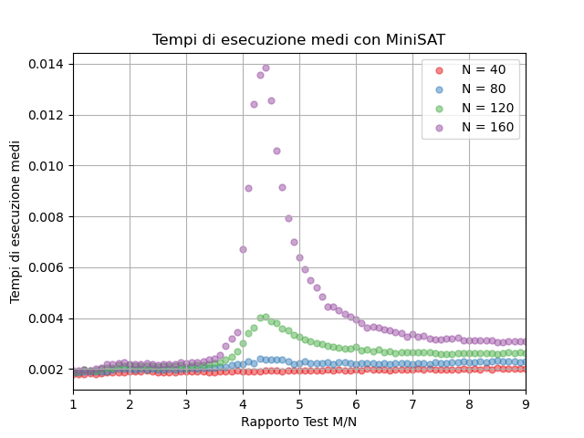 |
| SAT-UNSAT | 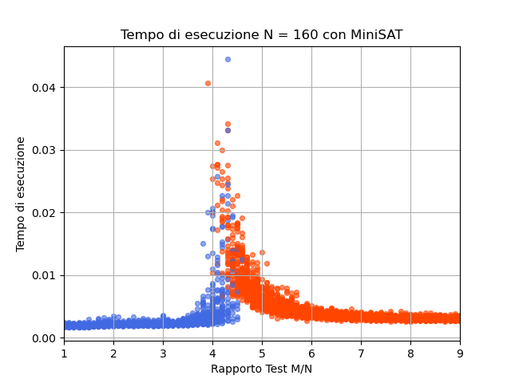 |
</details>


## Environment Setup

### Prerequisites

- Python **3.10+**
- (Only for `--solver minisat`) MiniSAT installed and available in PATH:
  
### Creating the Virtual Environment

```bash
# Clone the repository
git clone https://github.com/coseemo/3-SAT.git
cd 3-SAT

# Create and activate the virtual environment
python -m venv .venv
source .venv/bin/activate        # Linux / macOS

# Install dependencies
pip install numpy matplotlib pyyaml
```

---

## Usage

### 3-SAT Solver

All experiment parameters are centralized in the **`config.yaml`** file:

```yaml
experiment:
  num_tests: 100          # experiments per M/N ratio
  points_per_ratio: 50    # points in the distribution plot

variables:
  values: [10, 20, 30, 40]  # N values for the probability plot
  detailed: 40               # N for the distribution plot

solvers:
  backtracking: true
  heuristics: true
  minisat: false

output:
  dir: output
  formats: [png, pdf]

plots:
  probability: true
  times: true
  distribution: true
  palette: ["#e41a1c", "#377eb8", "#4daf4a", "#984ea3", "#ff7f00", "#ffff33"]
```

#### Running the Experiments

```bash
# Test a single solver
python main.py --solver backtracking
python main.py --solver heuristics
python main.py --solver minisat

# Run all three solvers and generate comparative plots
python main.py --all

# Use a custom configuration file
python main.py --all --config config.yaml
```

Plots are saved to the directory specified in `config.yaml` (default: `output/`), in the formats listed (default: PNG and PDF).

---

## References

- Franco Bagnoli. Lecture slides for statistical physics and complex systems.
- Niklas Eén and Niklas Sorensson. Minisat: A sat solver with conflict-clause minimization.
- Brian Hayes. Can’t get no satisfaction.
